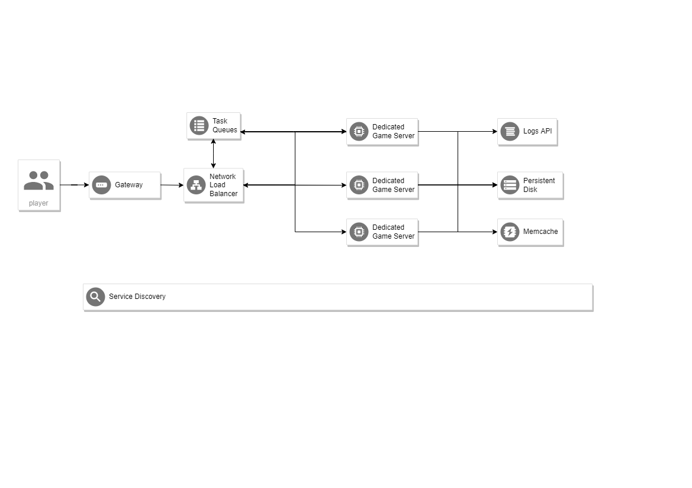
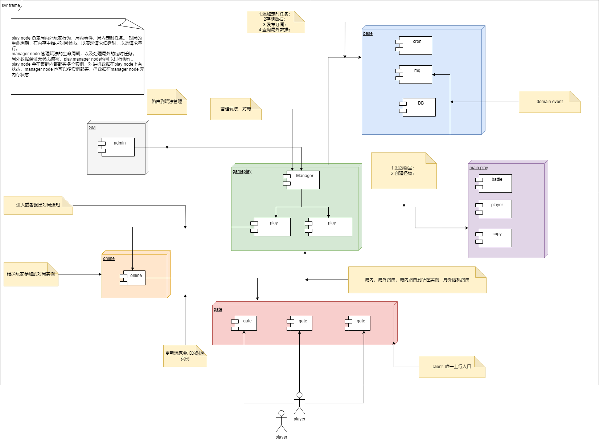
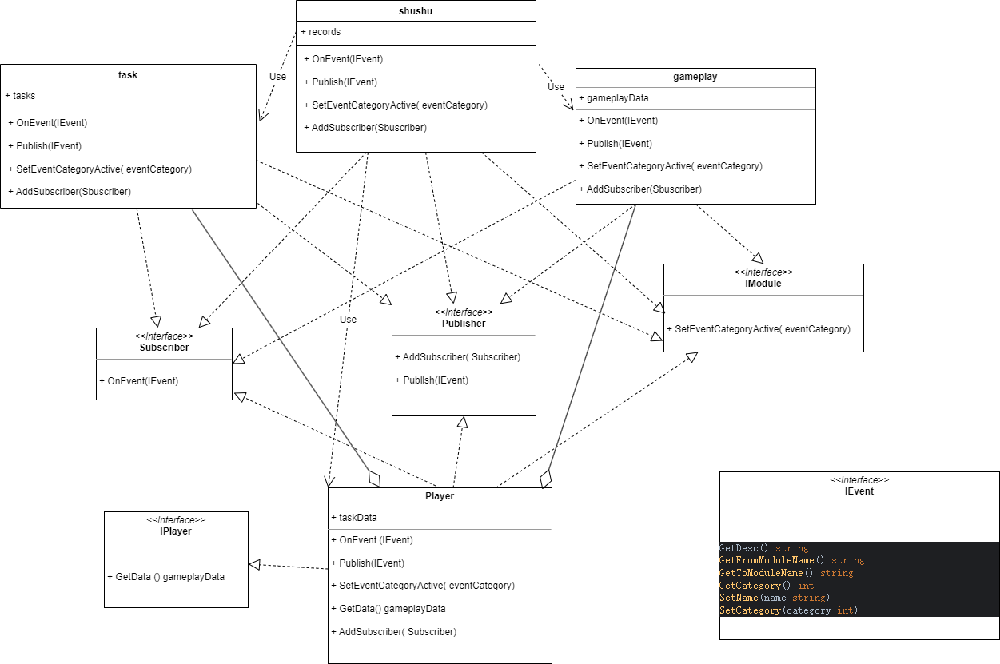

# `AllenServer`

 `AllenServer` is a  framework which include  the back-end logic of game . 
  AllenServer mainly learned from greatestworks by phuhao00 , great appreciate for his work.

## 学习目的 （original intention）

* 1.充分发挥 golang 语言特性 (Give full play to the features of golang language)

* 2.微服务思想,低耦合 (Micro service idea, low coupling)

* 3.面向对象+组合 (Object oriented+combination)

* 4.高性能 (High performance)

* 5.事件驱动 (Event driven)

## Server Frame

### 目录结构说明
* `aop`
  - 面向切面的逻辑
* `business`
  * `server`
    - 各个节点服务,include login ,gateway ,world,battle
  * `module`
    - include automation,event,record,communicate,note,purchase,gameplay 
* `gre`
  - 运维，部署，工具(createmodule;exel2json)等

### `module` 说明

每个模块包含
* `data`
  - 对应的数据存储
* `system`
  - 该模块的管理，例如数据的CRUD，有 `system` 的模块，其成员实例不具备 独立处理协程.
* `iplayer`
  - 定义player需要实现的方法
* `handler`
  - 处理从属模块需要的业务逻辑
* `I*`
  - 模块成员的抽象，接口定义,`eg:INpc`
* `config`
  - 配置,常量的定义等
* `module`
  - 模块的管理与维护，例如 event (事件)的处理
* `on_event`
  - 事件处理
 

模块与模块之间的联系通过 `player` 为中介，以事件订阅，发布的形式处理  
每个模块会管理自己激活的事件

### `Player`

 每个 `Player` 实例 拥有自己的协程

### `task`
  * 支持配置多协程处理业务逻辑
  - `Data` 存放 玩家任务实例数据
  - `impl` 任务类型的实现

  